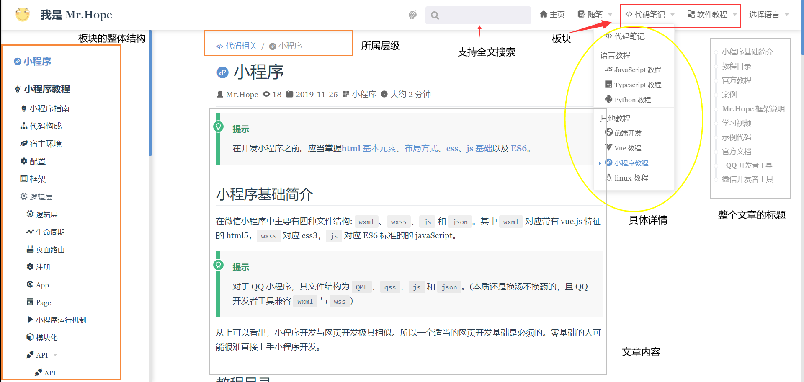
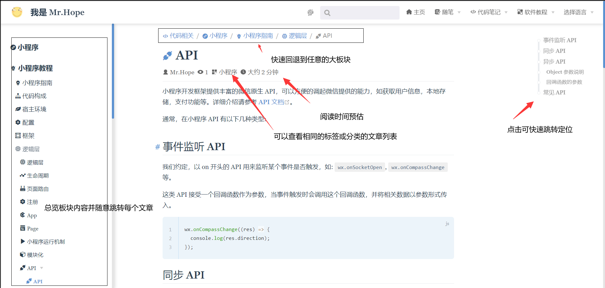

# 博客介绍

工作室的主要学习和参考均为 [Mr.Hope 的博客](https://mrhope.site)很多博文也是单独为了培训而书写的。

博客有百万字级别的内容，阅读完全部内容并理解正常来讲需要半年的时间。在很长一段时间内，你都可以将此博客作为一份参考文档来使用。

## 博客结构

博客拥有十分鲜明的结构。在导航栏中，博客列出了整体的分类，进入到每一个板块后，你可以通过查看侧边栏获得这一板块的整体内容与顺序。

## 内容搜索

博客拥有全文搜索功能，你可以使用导航栏中的搜索框对你想查找的内容进行搜索，这在后期的学习阶段十分有用。

## 具体页面展示

> 我的随笔就放过它吧
